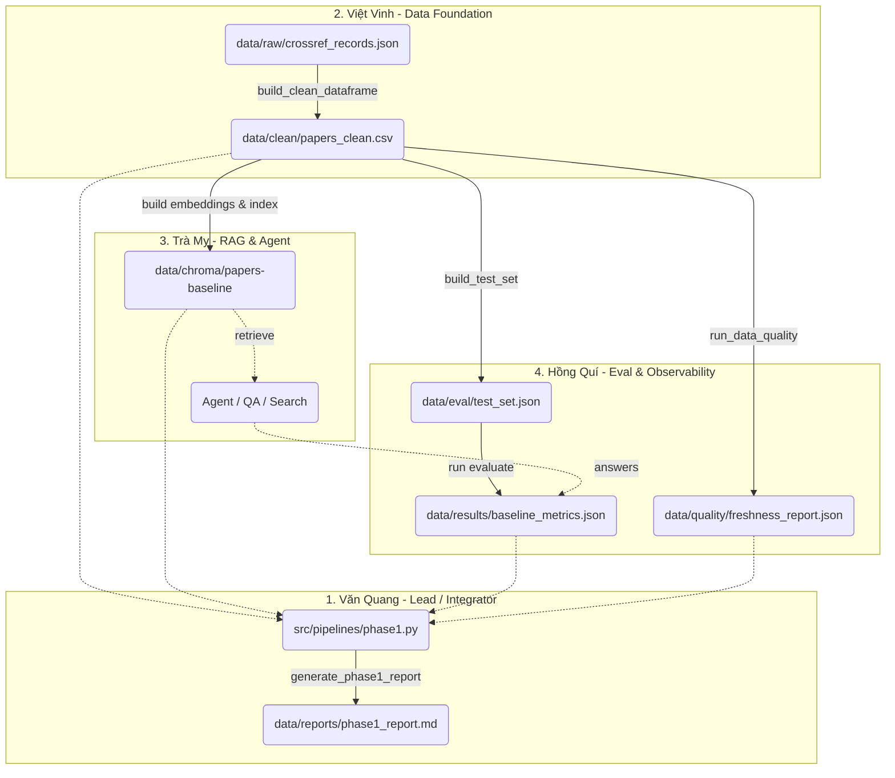

# Checkpoint 0: Khởi động, contract & ingestion raw (Vai trò: Lead)

Đây là kết quả thực hiện các công việc thuộc Checkpoint 0 dưới vai trò Lead/Pipeline integrator (Hoàng Văn Quang).

## 1. Phân công, Ownership, Branch & Artifacts
| Thành viên | Vai trò | Branch đề xuất | Artifacts chịu trách nhiệm (Paths) | Tiêu chí hoàn thành (DoD) |
|---|---|---|---|---|
| **Hoàng Văn Quang** | Lead, Orchestration | `feature/lead-pipeline` | `data/reports/phase1_report.md`, `data/reports/corruption_report.md` | Gắn kết thành công các pipelines, chạy thông lệnh `run_phase1.py` và xuất được báo cáo tổng. Mọi cấu hình đều được tải đúng từ `.env`. |
| **Nguyễn Thị Việt Vinh** | Ingestion, Cleaning, Repair | `feature/data-foundation` | `data/raw/*`, `data/clean/*` (gồm 3 trạng thái: baseline, corrupted, repaired) | Dữ liệu làm sạch không còn null, có `age_days`, `text_for_embedding` hoàn thiện. Artifacts xuất đúng format CSV/JSON. |
| **Hoàng Thị Trà My** | RAG, Agent, VectorDB | `feature/rag-agent` | `data/chroma/*`, `data/embeddings/*` | Xây dựng thành công collection `papers-baseline`. Agent truy xuất được dữ liệu thực tế và đúng nguồn. |
| **Tạ Hồng Quí** | Evaluation, Observability | `feature/eval-observe` | `data/eval/test_set.json`, `data/results/*`, `data/quality/*` | Bộ test set có ID khớp với `papers_clean`. Báo cáo quality và metrics được lưu thành file JSON hợp lệ. |

## 2. Kiểm tra Môi trường & Dependencies

- **Python Version**: Môi trường hiện tại đang sử dụng **Python 3.14.6**.
  > [!WARNING]
  > Yêu cầu của lab là Python 3.11–3.13. Việc dùng bản 3.14 có thể dẫn đến lỗi không tương thích ở một số thư viện. Hãy cân nhắc chạy đúng version yêu cầu (như 3.11 hoặc 3.12) nếu gặp lỗi trong quá trình xử lý tiếp theo.
- **Dependencies**: Các package cơ bản như `google-genai`, `openai`, `pandas`, `pytest`, `chromadb` (tuân theo `requirements.txt` / `pyproject.toml`) đã được cài đặt và detect trong danh sách `pip list`.
- **Cấu hình `.env` & Provider**:
  - `LLM_PROVIDER=gemini`
  - `LLM_MODEL=gemini-3.1-flash-lite`
  - `GOOGLE_API_KEY`: Đã được thiết lập thành công. Code sẽ chạy qua luồng `require_llm_credentials` trong `config.py` một cách bình thường.

## 3. Sơ đồ Handoff Dữ liệu (Raw → Clean → Index → Evaluate → Report)

## 4. Hiện trạng Xử lý `src/core/` và `src/pipelines/`
- **`src/core/config.py`**: Đã phân tích hàm `load_settings()`. Đã nắm rõ các artifact paths (ví dụ: `Settings.paths.clean_csv`) để cung cấp chính xác path cho các team members.
- **`src/pipelines/phase1.py` & `src/pipelines/corruption_flow.py`**: Hiện đang là các hàm skeleton với `NotImplementedError` và ghi chú pseudo-code. Chúng sẽ được code cụ thể ở các checkpoint 3 và 5, dựa trên sơ đồ Data Handoff phía trên (gọi hàm load data → clean → build index → đánh giá → sinh báo cáo).
